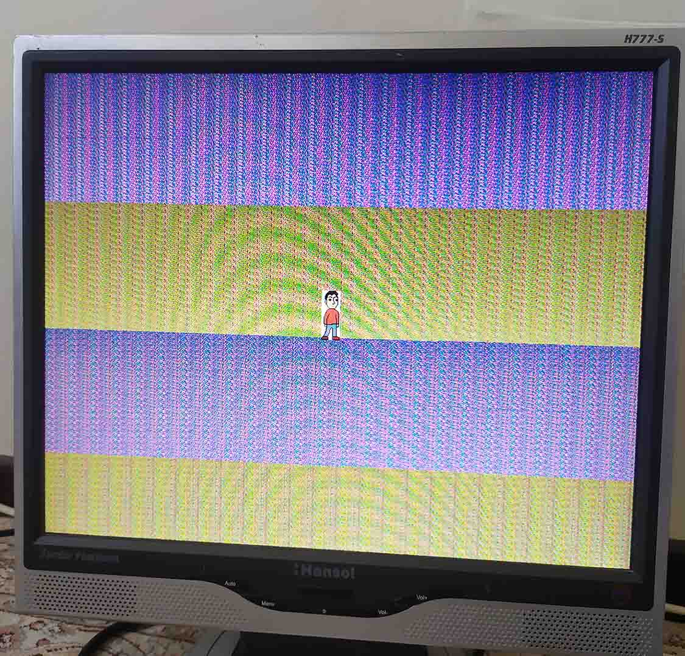
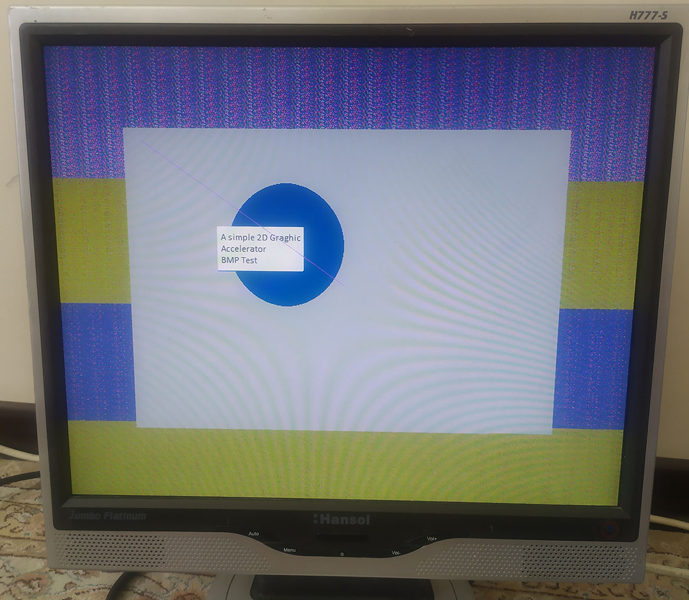
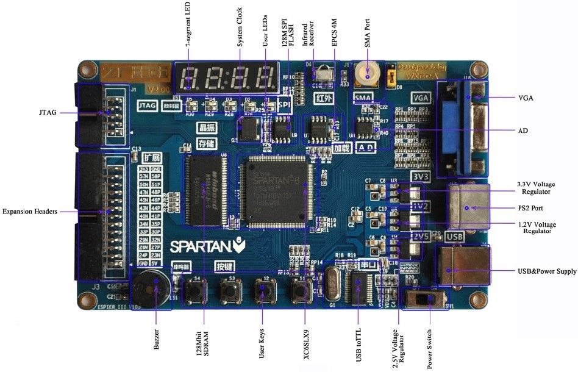

# SIGA: Simple Graphic Accelerator

SIGA is a 2D graphic accelerator developed from scratch, without the use of any IP core. The SDRAM controller implemented in this project utilizes burst commands wherever possible.

### Output Video Signal:

- SVGA Signal: 800x600 resolution @ 56 Hz timing
- Pixel Format: RGB565

### Current Drawing Abilities:
- Filling rectangles
- Drawing lines (implemented using the Bresenham algorithm)
- Drawing circles (implemented using the Bresenham algorithm)
- Filling circles (implemented using the Bresenham algorithm)

### Future Developments:

- Adding support for drawing triangles
- Implementing alpha-blending
- Incorporating anti-aliasing techniques

---

Here's the continuation of your text with some revisions:

Example and Board Specifications:
Included in this repository is an example demonstrating the current status of the project. For testing purposes, I utilized the ESPIER_III V105 board, which is an affordable Spartan6 board. Please note that the board's labels are in Chinese and are located in the corner.

### Board Specifications:
- FPGA: xc6slx9-2tqg144c (This model appears to lack an internal hard DDR controller)
- SDRAM: w9864g6kh

For detailed board schematics, refer to the [ESPIER_III-Schematic.pdf](document/Espier_III-Schematic.pdf) document in this repository.

# Example Images:
Here are some images showcasing the example:

Used Board:

